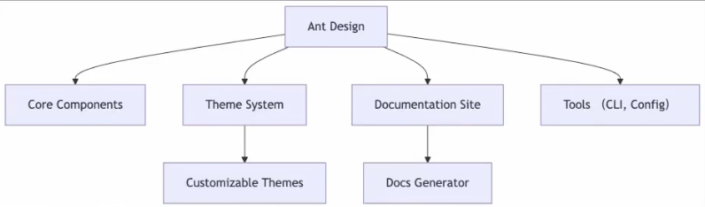
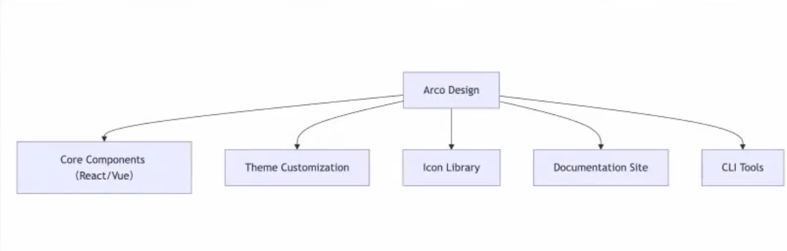

# pnpm-monorepo

基于 pnpm workspace 实践的多包管理项目

## apps - 业务系统目录

- backend - 服务端业务
- frontend - 前端业务

## packages - 基础包目录

- chart - 图表库
- cli - 脚手架
- tools - 工具库
- ui - 组件库

 
## 大厂中的 monorepo 最佳实践

- 阿里巴巴 - [umi](https://github.com/umijs/umi)
- 腾讯 - [TDesign](https://github.com/Tencent/tdesign)
- 字节 - [ByteDance/Monorepo](https://github.com/ByteDance/Monorepo)
- 美团 - [meituan/monorepo](https://github.com/meituan/monorepo)
- 滴滴 - [didi/monorepo](https://github.com/didi/monorepo)
- 京东 - [jd/monorepo](https://github.com/jd/monorepo)

- antd

- Arco Design - [arco.design](https://github.com/arco-design/arco.design)

